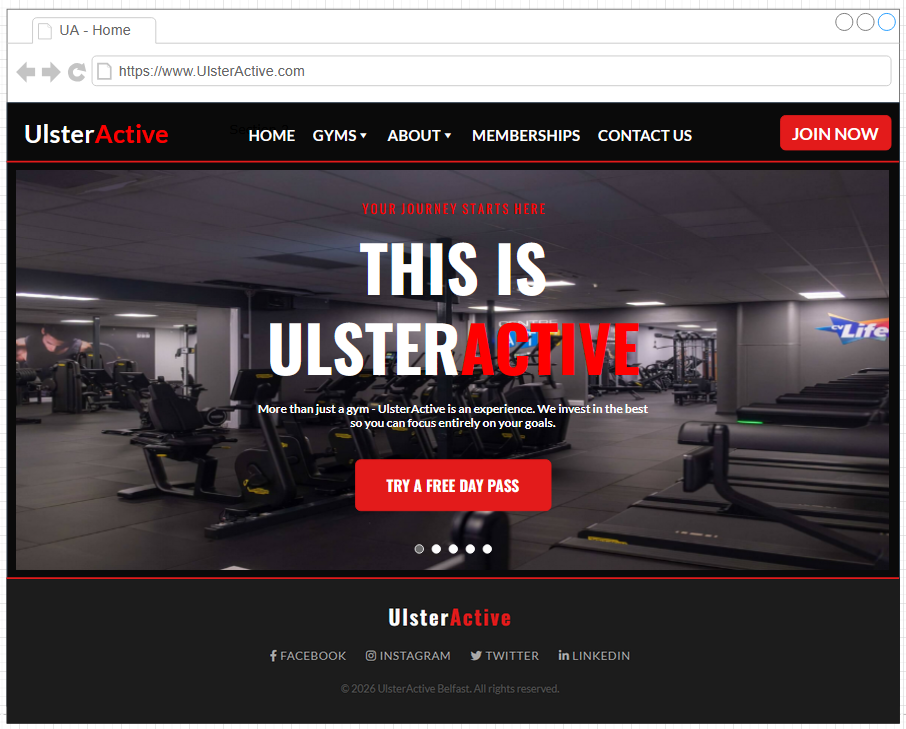

Client Side Development - Group 2

# Project Structure

### COURSEWORK/
* **Documents/**: Project planning and meeting records.
    * `Minutes`: A record of our team meetings and progress.
* **Website/**: The core folder containing all files for the live site.
    * **CSS/**: Contains the site styling.
        * `styles.css`: All site styling and layout rules.
    * **Images/**: All visual assets for the website.
        * `general-img-square.png`, `Gym.jpg`, `MainDesign.png`.
    * **JavaScript/**: Script files for interactivity.
        * `checkMembership.js`, `homePageScripts.js`.
    * **Webpages/**: Secondary HTML pages.
        * `about.html`, `contact.html`, `membership.html`, `finagy.html`, `timetables.html`, `yorkgate.html`.
    * `home.html`: The main landing page.
* **Wireframe/**: Design blueprints.
    * `Wireframes.drawio`: Visual blueprints of the site layout.
* **README.md**: General project overview and setup instructions.

How to Run

    Clone this repository.

    Navigate to the MainWebsite folder.

    Open home.html in any modern web browser.

Built With

    HTML5 - Page structure

    CSS3 - Custom styling

    JavaScript - Client-side interactivity

    Draw.io - Wireframing and design

Team Members

    Daniel

    Riley

    Cian

    Odhrán
