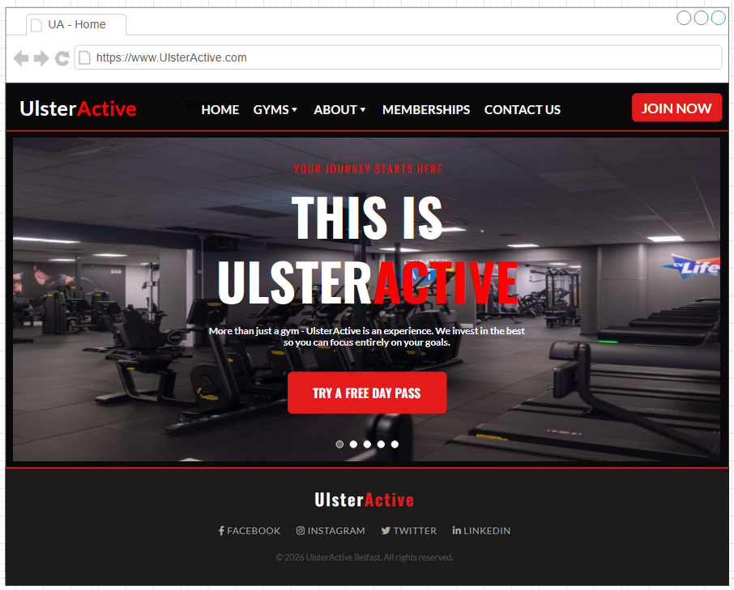

Client Side Development - Group 2

**EXAMINER NOTICE: Check each member's commit history on their profile which reflects only on this project, as a push origin main --force was used by one account.** `Members have committed more than what is
shown in this repo history, check profiles only.`

### COURSEWORK/
* **Documents/**: Project planning and meeting records.
* **Website/**: The core folder containing all files for the live site.
    * **CSS/**: Contains the site styling.
        * `styles.css`: All site styling and layout rules.
    * **Images/**: All visual assets for the website.
    * **JavaScript/**: Script files for interactivity.
        * `checkContact.js`: Handles contact form validation.
        * `checkMembership.js`: Manages membership form logic.
        * `homePageScripts.js`: General interactive elements for the home page.
        * `searchbar.js`: Logic for the site search functionality.
    * **Videos/**: Video assets for the website.
    * **Webpages/**: Secondary HTML pages.
        * `about.html`: Information about the gym/organization.
        * `contact.html`: Contact form page.
        * `finagy.html`: Specific location or branch page.
        * `membership.html`: Details on membership plans.
        * `timetables.html`: Class and opening hour schedules.
        * `yorkgate.html`: Specific location or branch page.
    * `home.html`: The main landing page (index).
* **Wireframe/**: Design blueprints.
    * `Wireframes.drawio`: Visual blueprints of the site layout.
* **README.md**: General project overview and setup instructions.

How to Run

    Clone this repository.

    Navigate to the Coursework folder.

    Open home.html in any modern web browser.

Built With

    HTML5 - Page structure

    CSS3 - Custom styling

    JavaScript - Client-side interactivity

    Draw.io - Wireframing and design

